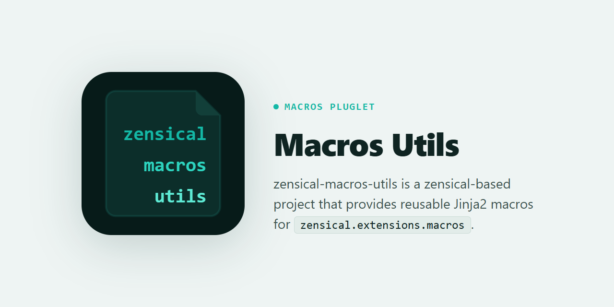

# zensical-macros-utils

<picture>
  <source media="(prefers-color-scheme: dark)" srcset="docs/assets/img/banner-dark.png">
  <source media="(prefers-color-scheme: light)" srcset="docs/assets/img/banner-light.png">
  
</picture>

[zensical-macros-utils](https://pypi.org/project/zensical-macros-utils/) is a [zensical](https://zensical.org/)-based project that provides macros to extend cards, code blocks, etc, in Zensical documents.

[](https://github.com/7rikazhexde/zensical-macros-utils/actions/workflows/pages/pages-build-deployment) [](https://7rikazhexde.github.io/zensical-macros-utils/)

## Features

- **Link Card**: Create link cards with images and descriptions, etc
- **Gist Code Block**: Embed and syntax-highlight code from GitHub Gists
- **X/Twitter Card**: Embed tweets with proper styling and dark mode support

## Usage

### Install [zensical-macros-utils](https://pypi.org/project/zensical-macros-utils/)

```bash
# For pip
pip install zensical-macros-utils

# For uv
uv add zensical-macros-utils
```

### Config settings

Add the extension to your config file. If both `zensical.toml` and `mkdocs.yml` exist, `zensical.toml` takes priority.

#### `zensical.toml`

```toml
extra_css = [
    "stylesheets/macros-utils/link-card.css",
    "stylesheets/macros-utils/gist-cb.css",
    "stylesheets/macros-utils/x-twitter-link-card.css",
]

extra_javascript = [
    "javascripts/macros-utils/x-twitter-widget.js",
]

[project.plugins.macros]
modules = ["zensical_macros_utils"]

[project.extra.debug]
link_card = false
gist_codeblock = false
x_twitter_card = false
```

#### `mkdocs.yml` / `mkdocs.yaml`

```yaml
extra_css:
  - stylesheets/macros-utils/link-card.css
  - stylesheets/macros-utils/gist-cb.css
  - stylesheets/macros-utils/x-twitter-link-card.css

extra_javascript:
  - javascripts/macros-utils/x-twitter-widget.js

theme:
  name: material
  variant: classic  # omit or set "modern" to use zensical's new design

plugins:
  - search
  - macros:
      modules:
        - zensical_macros_utils

extra:
  debug:
    link_card: false
    gist_codeblock: false
    x_twitter_card: false
```

Start the development server:

```bash
uv run zensical serve
```

The plugin will automatically create the required directories and copy CSS/JS files during the build process.

## Documentation

For detailed usage and examples, please see the [documentation](https://7rikazhexde.github.io/zensical-macros-utils/).

## License

MIT License - see the [LICENSE](./LICENCE) file for details.
